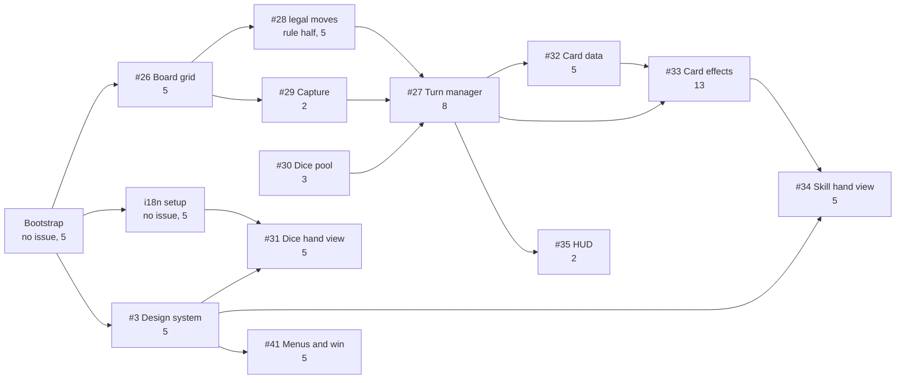

# Project Plan: time, resources, risks

How the remaining work is scheduled, who does it, and what has to be true for the schedule to hold.

This plan does not introduce new scope. What is to be built is in
[Requirements-Specification.md](Requirements-Specification.md), what it costs is in
[Effort-Estimation.md](Effort-Estimation.md), and what can go wrong is in
[03-Risk-Analysis.md](03-Risk-Analysis.md). This document is the one that has to **decide** things,
because three contradictions have been carried forward across four documents without anyone settling
them: the buffer sprint, the roles, and the sprint assignment of the implementation backlog. A
contradiction that survives into the report is a finding either way, but a contradiction nobody
decided is a worse one than a contradiction someone resolved and recorded.

---

## 1 What this plan decides

| Open point | Carried in | Decided here |
| --- | --- | --- |
| The board has no buffer sprint, the written plan has one | [sprint-log.md](../Documentation/sprint-log.md), [Feasibility-Study.md](Feasibility-Study.md), [00-One-Pager.md](00-One-Pager.md) | Section 2.2 |
| Board Sprint 3 is 1½ weeks, not 2 | same | Section 2.2 |
| Two role tables disagree on whether a Scrum Master exists | [00-index.md](../Documentation/00-index.md), [notes/02-project-management.md](../Documentation/notes/02-project-management.md) | Section 3.1 |
| The implementation backlog carries no sprint | [notes/02-project-management.md](../Documentation/notes/02-project-management.md) | Section 4.4 |
| Board Sprint 0 runs 2½ weeks against a planned 1 week | [sprint-log.md](../Documentation/sprint-log.md) | Section 2.5, and it stays as it is |

---

## 2 Time

### 2.1 The calendar

Board dates, which are the authoritative ones as of the 2026-08-22 decision in
[project-journal.md](../Documentation/project-journal.md). Weekday counts computed rather than
estimated.

| Sprint | Start | End | Weekdays | State on 2026-08-22 |
| --- | --- | --- | --- | --- |
| Sprint 0 | 2026-07-23 | 2026-08-09 | 12 | Closed, 7 issues done |
| Sprint 1 | 2026-08-10 | 2026-08-23 | 10 | Closing, 11 of 13 done at best |
| Sprint 2 | 2026-08-24 | 2026-09-06 | 10 | No scope assigned |
| Sprint 3 | 2026-09-07 | 2026-09-17 | 9 | No scope assigned |

**19 weekdays remain** after Sprint 1 closes. That is the number every figure below rests on, and it
is the number the whole project has left.

### 2.2 Decision: there is no buffer sprint, and Sprint 3 is not one either

**Decided: the project has four sprints, Sprint 0 to Sprint 3, and no fifth buffer sprint. The
closing work is a named window inside Sprint 3 rather than a sprint of its own.**

The reasoning, in the order it matters:

1. The board is the single source of truth for sprint membership, decided 2026-08-22. It defines
   Sprint 0 to Sprint 3 and stops. Inventing a fifth sprint in a document while the board has four
   would reopen exactly the artefact-versus-board gap that decision closed.
2. The buffer content is real work with real issues on the board: #24 *Usability & Playtest
   Evaluation* and #25 *Presentation Deck & Live Demo Prep*, 10 points between them. It cannot be
   dropped along with the sprint that used to hold it, because the playtest is where the usability
   evidence for the report comes from and the fallback video is a named mitigation of the live-demo
   risk.
3. Sprint 3 is 9 weekdays. Asking it to hold polish, art, audio, playtesting, the video and the
   presentation deck without saying where one stops and the next begins is how the closing work gets
   started in its last two days.

So Sprint 3 is split at a stated date:

| Window | Dates | Weekdays | Contains |
| --- | --- | --- | --- |
| Sprint 3, implementation half | 2026-09-07 (Mon) to 2026-09-11 (Fri) | 5 | The last implementation and polish work. **Feature freeze at the end of 2026-09-11.** |
| Sprint 3, closing window | 2026-09-14 (Mon) to 2026-09-17 (Thu) | 4 | #24 playtest and evaluation, #25 deck and fallback video, #19 report, #20 closure report. Bug fixes only, no new features. |

**Rejected alternatives, both of which were live:**

- **Sprint 3 doubles as the buffer sprint under another name.** Rejected because it is a label and
  not a plan: it leaves the boundary between building and closing undefined, which is the only thing
  the split is for. The 1½-week length is what made this reading tempting, and length alone is not
  evidence.
- **Add a fifth sprint to the board after 2026-09-17.** Rejected because no date after 2026-09-17 is
  known to be available. The board's last date is 2026-09-17 and the module's actual deadline is not
  recorded anywhere in this repository (see the standing open question in
  [00-index.md](../Documentation/00-index.md)). Planning past the last date anyone wrote down would
  be planning into a period that may not exist.

**The cost of this decision, stated rather than absorbed.** Implementation now has **15 weekdays**,
2026-08-24 to 2026-09-11, not 19. Section 3.3 carries what that does to the required rate, and it
makes the capacity finding worse rather than better. That is the honest consequence of putting the
closing work in the calendar instead of leaving it implied.

### 2.3 Milestones

Each milestone is a state that can be checked, not a date by which people intend to have tried.

| # | Milestone | Date | Checkable by |
| --- | --- | --- | --- |
| M1 | Toolchain up | 2026-08-25 | `npm run dev`, `npm run lint` and `npm test` all run. The bootstrap is 5 points and nothing else can start without it (section 3.6 of [Effort-Estimation.md](Effort-Estimation.md)). |
| M2 | A pawn moves on a real board | 2026-08-31 | #26 and the rule half of #28: a pawn enters the track on the die maximum, moves the rolled count, and the position arithmetic is unit tested. |
| M3 | A full turn resolves | 2026-09-06 | #27, #29, #30, #31: draw 3 dice cards, choose one, roll, move, capture, next player. End of Sprint 2. This is the milestone the project is judged playable at. |
| M4 | Skill cards resolve, feature freeze | 2026-09-11 | #32, #33, #34: an Action card and a Reaction card both change the outcome of a turn. End of the implementation half of Sprint 3. |
| M5 | Closed out | 2026-09-17 | E2E flows E1 to E12 of [Test-Plan-and-Quality-Strategy.md](Test-Plan-and-Quality-Strategy.md) pass, the playtest has been run with external people, the fallback video exists, the deck exists, the report is written. |

**M2 and M3 are the two that matter.** M3 is the point at which the deliverable is a game that can be
played to a finish, which is the definition of the MVP in the one-pager. If M3 slips, the scope
conversation of section 5.4 of [Effort-Estimation.md](Effort-Estimation.md) happens on 2026-09-06 at
the latest, and it happens with the Product Owner rather than inside a commit.

### 2.4 What follows for the polish and presentation scope

The prose plan gives Sprint 3 sprites, animations, UI skins, particle effects, sound effects,
background music, and the menu and win-screen flow. Against 5 implementation weekdays that is not a
scope, it is a wish list. What holds and what does not:

- **Holds:** #41 main menu, pause and win screen flow (5 points), because FR-06 restart and the win
  screen are `must have` and a game with no way to start or finish a match is not playable. #35 HUD
  (2 points) for the same reason.
- **Holds if the visual design exists by then:** #40 audio (3 points). The four sounds and the mute
  are cheap to wire; the assets do not exist and no asset was ever budgeted.
- **Does not hold:** particle effects and UI skins. Neither carries a requirement id, so neither is
  in the requirements specification at all. They are the first things to go and they cost nothing to
  drop, which is why they are named here rather than discovered missing.
- **Blocked on someone else:** everything visual depends on issue #3 *Create Design System*, 5
  points, developed with Claude Design. The obligations book deliberately contains no palette,
  spacing or typography, so until #3 lands, every view is built against a design that does not exist.
  **#3 should be scheduled in Sprint 2, not Sprint 3**, because it blocks four UI issues and is
  blocked by none of them.

### 2.5 Sprint 0's length stays as it is

Board Sprint 0 runs 2026-07-23 to 2026-08-09, 2½ weeks against the planned 1 week, and starts two
weeks before the repository existed. **Not corrected.** The dates are what the board records and the
board is authoritative; back-dating them to match the prose plan would be editing history to make a
plan look kept. The gap is a finding for Chapter 11: the first sprint was over half again its planned
length before any tracking existed to notice.

---

## 3 Resources

### 3.1 Decision: no dedicated Scrum Master

**Decided: the role table of [00-One-Pager.md](00-One-Pager.md) holds. Fabian Gemming is Product
Owner, Lars Bolender and Benedict Glatz are Scrum Members who also carry the Scrum Master work. The
Developer A/B/C table in [01-Github-Project.md](01-Github-Project.md) is superseded.**

Three reasons:

1. The one-pager names real people. The A/B/C table names placeholders and was never filled in, which
   is what an unfinished template looks like rather than a competing decision.
2. It matches what actually happened. Sprint 1's board hygiene, the branch layout correction and the
   sprint log were done by the Scrum Members, not by anyone holding a Scrum Master role.
3. The one-pager is the Product Owner's own document, so on a question of who holds which role it is
   the better authority.

**Rejected: appoint one of the three as Scrum Master now.** It would make the report's process chapter
tidier and it would be a fiction. Nobody has performed that role for two sprints, and describing a
role nobody filled is worse for the grade than explaining why the team of three did without one. What
does follow from having no Scrum Master is recorded as a finding: the board hygiene that a Scrum
Master would own was skipped for the whole of Sprint 1 and caught up on its second-to-last day.

**What survives from the A/B/C table** is its good idea, which is pairing each person with a
technical area rather than leaving ownership implicit. It does not survive as three lead roles,
because it assumes three implementers and there are two.

### 3.2 Technical ownership

| Person | Scrum role | Technical area |
| --- | --- | --- |
| Fabian Gemming | Product Owner | Rules and balance: the 8 open decisions of section 9 of [Game-Design-Document.md](Game-Design-Document.md), the dice pool composition, the skill card catalogue. Does not implement. |
| Lars Bolender | Scrum Member | Shared across `core/`, `state/` and `ui/`. Split per issue at sprint planning, not per layer. |
| Benedict Glatz | Scrum Member | Shared across `core/`, `state/` and `ui/`. Split per issue at sprint planning, not per layer. |

**Why the two implementers are not split by layer**, which is the obvious alternative and was
rejected: the critical path of section 4.3 runs straight through all three layers, so a layer split
would put one person on the critical path and the other waiting on it. Splitting per issue lets both
work at once as long as the issues are independent, which section 4.3 shows they largely are not.
Recorded because the layer split looks natural given that the architecture is layered, and the
architecture is not a work breakdown.

**The bus factor stays 1 per area and is not fixed by this plan.** It is a rated risk (role
concentration, priority 3), and with two implementers there is nothing to distribute. The mitigation
stays the documentation-notes practice, which is the only redundancy this team has.

### 3.3 Capacity, and the required rate

From [Effort-Estimation.md](Effort-Estimation.md): 110 implementation points and 28 documentation
points open, of which 74 implementation points are `must have`.

| Against | Weekdays | Must-have implementation | Required rate |
| --- | --- | --- | --- |
| The full remaining calendar | 19 | 74 points | 3.9 points per weekday |
| Implementation half only, after the section 2.2 split | 15 | 74 points | **4.9 points per weekday** |

The estimation document computed 3.9 against 19 weekdays, which assumed implementation runs to the
last day of the board calendar. This plan puts a feature freeze on 2026-09-11, so the honest figure is
4.9, and the 28 documentation points plus the closing work sit outside it in the 4-weekday window.

**There is still no velocity to compare either figure to.** Sprint 0 and Sprint 1 closed 7 and at
most 11 issues, both counts and neither with a single story point attached, and every issue closed so
far is a document. The first sprint that records points against closed issues is the first time any of
this is checkable. Both numbers above are therefore **required rates and not forecasts**, which is the
same caveat the estimation document states and it does not weaken with repetition.

**The finding does not change: the must-have set does not fit.** It gets worse by the 4 weekdays this
plan moves out of implementation. Section 5.4 of the estimation document holds, including its
conclusion that the drop order releases 36 points of which none is must-have, so the remaining levers
are the calendar and the quality bar. This plan pulls the one calendar lever available to it, which is
sequencing (section 4), and the two it cannot pull are the Product Owner's: cut a must-have and stop
being a game, or move a date nobody has confirmed is movable.

---

## 4 Work package dependencies

### 4.1 The graph

Taken from [System-Architecture.md](System-Architecture.md), so it is the import direction rather
than an intuition about what feels prerequisite.



Three dependencies in that graph are worth stating in words, because they are the ones a sprint plan
gets wrong:

- **#30 before #27.** The dice pool has to supply a die before the turn manager can run a turn, and
  it is a 3 rather than a 5, so it is cheap to do early. This is the same finding as the D6 mismatch
  below, seen from the dependency side.
- **#32 before #33.** Card effects need cards to exist. #33 is the 13, so anything that delays #32
  delays the largest item in the backlog.
- **#3 before every view.** The design system blocks #31, #34 and #41, which is 15 points of UI, and
  is blocked by nothing. It is the cheapest unblocking move available and it is currently unscheduled.

### 4.2 The D6 dependency is real, not theoretical

Section 3.4 of [Requirements-Specification.md](Requirements-Specification.md) flags it: the prose
plan gives Sprint 1 a "standard 1 to 6 dice roll", while FR-09 makes leaving the start area depend on
the **maximum of the chosen die**. Building against a fixed D6 and replacing it later means writing
the leaving rule twice.

**Decided: no fixed D6 is ever built.** #30, the dice pool data model, is scheduled in the same sprint
as #27 and before it, so the turn manager takes a die from the pool from its first commit. The cost is
3 points brought forward. The alternative costs the leaving rule twice plus its tests twice, and the
second write happens under more schedule pressure than the first.

### 4.3 Critical path

The longest chain of work that cannot be parallelised, in points:

```
Bootstrap 5  ->  #26 Board 5  ->  #28 rule half 5  ->  #27 Turn manager 8  ->  #32 Cards 5  ->  #33 Effects 13  ->  #34 Hand UI 5
```

**46 points on one chain, of 74 must-have points.** Against 15 implementation weekdays that is about
3.1 points per weekday on the critical path alone, and the critical path is one person's work at a
time for most of its length: #27 and #33 are the two integration points every other module depends on,
and two people cannot write one turn manager faster than one can.

**What the second implementer does in parallel**, and this is where the slack is:

| Parallel to the chain | Points |
| --- | --- |
| i18n setup and locales | 5 |
| #3 design system | 5 |
| #29 capture | 2 |
| #30 dice pool, #31 dice hand view | 8 |
| #35 HUD, #40 audio, #41 menus | 10 |
| CI workflow | 2 |
| **Total available off the critical path** | **32** |

32 points of parallel work against 46 on the chain. **The second implementer runs out of independent
work before the first finishes the chain**, and what is left at that point is #33, which is exactly
the item least suited to being split between two people. That is the schedule's real shape, and it is
not visible from the point total alone.

**Consequences, and they are the actionable part of this plan:**

1. **Split #28** into the legal-move rule and the movement animation, as section 5.4 of the estimation
   document already recommends. The rule is on the critical path, the animation is not. This shortens
   the chain by nothing and frees 3 points of parallel work, which is the cheapest change available.
2. **Pair on #33 rather than parallelising around it.** Eight effects are eight independent functions
   once the resolution seam exists, so the split point is after the seam and not before it.
3. **Front-load everything off the chain into Sprint 2.** The 32 parallel points are the only buffer
   the plan has, and a buffer spent early is a buffer that was there when it was needed.

### 4.4 Decision: the implementation backlog gets its sprint assignment now

**Decided: assign #26 to #41 and the three missing issues to Sprint 2 and Sprint 3 on the board, per
the split below. The deferral ends.**

It was deferred deliberately and that was defensible while nothing was estimated. Now that everything
is estimated, leaving 27 issues with no sprint means the board cannot show progress against a plan,
which is the same class of gap that made Sprint 1's whole gameplay scope invisible until 2026-08-22.

| Sprint | Issues | Points |
| --- | --- | --- |
| Sprint 2, 2026-08-24 to 2026-09-06 | Bootstrap, i18n, #3, #26, #28, #29, #30, #31, #27 | 46 |
| Sprint 3 implementation half, 2026-09-07 to 2026-09-11 | #32, #33, #34, #35, #40, #41, CI | 35 |
| Sprint 3 closing window, 2026-09-14 to 2026-09-17 | #24, #25, #19, #20, ~~#17~~ | ~~23~~ 21 |
| Not scheduled | #42 to #46, the extended features | 34 |

**Revised 2026-08-22, the same day.** #17, the project structure plan, was pulled into Sprint 1 by
the team and now carries `Sprint 1` on the board, so it leaves the closing window, which drops from
23 to 21 points. The pull is the right direction: a structure plan written in the last four days of
the project would document a breakdown after all the work it breaks down is over.

**46 points in 10 weekdays and 35 in 5 is not a balanced split, and the imbalance is the point.**
Sprint 3's implementation half carries 35 points against 5 weekdays, which is 7 points per weekday
against a required average of 4.9, and that is where the must-have set stops fitting. Printing the split is what makes that visible on a board instead of
arriving as a surprise in the second week of September. The alternative, a split that looks
achievable, would need scope to be cut first, and cutting must-have scope is not this document's
decision to make.

**Blocked on a token scope.** Setting the `Sprint` field needs the `project` scope that the `gh` token
does not carry, the same gap that blocks the `Story Points` field. The assignment above is therefore a
decision recorded in a document and an action outstanding on the board. Both are listed in section 6.

---

## 5 Risks

### 5.1 The register is cited, not restated

[03-Risk-Analysis.md](03-Risk-Analysis.md) holds 16 rated risks with a mitigation each. Restating
them here would create a second copy that drifts from the first. The rows this plan depends on
directly:

| Risk | Priority | Why this plan depends on it |
| --- | --- | --- |
| Sprint-plan versus board-date contradiction | 4 | Section 2.2 is its mitigation, carried out. |
| Documentation notes not kept per-commit | 4 | The 28 documentation points of section 3.3 assume the notes stay current. If they lapse, #19 stops being an 8. |
| Test coverage discipline slips under time pressure | 3 | The quality bar is one of the two levers section 3.3 says are left, so it is the one under pressure when the rate is not met. |
| Role concentration / bus factor | 3 | Section 3.2 states plainly that this plan does not fix it. |
| External playtester availability | 3 | The closing window of section 2.2 is 4 weekdays. Playtesters found in that window will not be found in time. |

### 5.2 Rows this branch re-rated

Recorded here so the report can show that the register moved with the work rather than being written
once:

| Row | Change | Issue |
| --- | --- | --- |
| Board layout and win conditions underspecified | 4 to 3, likelihood M to L | #22 |
| No velocity or burn-down data producible | 4 to 3, likelihood H to M | #16 |
| Test coverage discipline slips | **Deliberately unchanged at 3**, mitigation extended only | #23 |

The third row is the one worth reading: a written test plan does not lower the likelihood of coverage
slipping, because no CI runs the gates it describes. Leaving a rating alone when the artefact exists
is a judgement, and it is recorded as one.

**Settled 2026-09-02, issue #68, and this is the half that makes the judgement above worth anything.**
`.github/workflows/build-check.yml` landed and runs all five gates on every pull request, so the
condition this row named for itself was met and the row moved from M/M/3 to L/M/2 in
[03-Risk-Analysis.md](03-Risk-Analysis.md). A register that announces its own trigger in advance and
then honours it is a different artefact from one adjusted in hindsight, and after the project is
finished the two are indistinguishable unless both halves are written down. Closing that risk created a
smaller one, recorded in the same file under *Risks added 2026-09-02*: the check reports on a pull
request but does not block a merge, because that needs a branch-protection ruleset that still does not
exist.

### 5.3 Risks this plan creates

Every plan adds risk by committing to something. All five were **added to
[03-Risk-Analysis.md](03-Risk-Analysis.md) on 2026-08-22** rather than left here, because a risk that
lives only in the document that created it is not in the register that gets reviewed.

| Risk | Likelihood | Impact | Priority | Response |
| --- | --- | --- | --- | --- |
| The 2026-09-11 feature freeze is missed and the closing window is eaten | H | H | 5 | This is the plan's highest risk and it follows from section 3.3: the required rate is 4.9 points per weekday, unvalidated. The response is M3 on 2026-09-06: if a full turn does not resolve by then, scope is cut with the Product Owner rather than the freeze being moved. |
| The critical path stalls on one person | M | H | 4 | #27 and #33 are 21 points that do not split. Response: pair on both, and front-load the 32 parallel points so the other implementer is never blocked waiting. |
| No date after 2026-09-17 is known to exist | M | H | 4 | The board's last date is the last date this project can plan against, and the module deadline is recorded nowhere. Response: find out the real deadline before Sprint 2 starts. It is one question to one person and it changes every number in this document. |
| The sprint assignment of section 4.4 never reaches the board | H | M | 4 | Blocked on the `project` token scope, which an agent cannot grant. Response: one interactive `gh auth refresh -s project`, which also unblocks the `Story Points` field and the card moves. Same single action, three blocked outcomes. |
| The point scale is wrong in one direction | M | M | 3 | Single-estimator estimates, unvalidated. Response: record points against the first three issues closed in Sprint 2 and re-check the totals then, rather than at the end. |

---

## 6 Outstanding actions

Ordered by what unblocks the most.

1. **One interactive `gh auth refresh -s project`.** Unblocks the `Story Points` field, the `Sprint`
   assignment of section 4.4, and moving board cards. Three blocked things, one action, a human has
   to do it.
2. **Ask what the module's actual deadline is.** Section 5.3 rates this a 4. Every date in this
   document assumes 2026-09-17 because that is the last date the board carries, and nothing confirms
   it is the real one.
3. **Fabian signs off section 9 of [Game-Design-Document.md](Game-Design-Document.md).** Eight rules
   are proposed and unsigned. An override on FR-12 changes the legal-move calculation and moves #28.
4. **Create the three missing issues** (bootstrap, i18n, CI) so the board stops understating the work
   by 12 points, and **split #28**.
5. **Schedule #3 design system in Sprint 2**, per section 2.4. It blocks 15 points of UI work and is
   blocked by nothing.
6. **Confirm this plan and the Definition of Done in a planning slot.** Both are written and neither
   is adopted, which is the distinction section 5 of
   [Test-Plan-and-Quality-Strategy.md](Test-Plan-and-Quality-Strategy.md) also draws about itself.

---

## 7 What this plan does not decide

- **It does not cut scope.** It shows that the must-have set does not fit and names who decides what
  happens about that. Cutting a must-have is the Product Owner's call and it is not made here.
- **It does not resolve the resource and energy system.** Section 6.7 of the game design document
  rules it out of the MVP and the Sprint 2 prose plan still lists it. The requirements specification
  is the authority and it carries no requirement for it, so it is out, but the prose plan in
  [01-Github-Project.md](01-Github-Project.md) still says otherwise and nobody has edited it.
- **It does not choose a multiplayer technology.** #42 is `should have`, 13 points, and named as the
  largest available cut. Nothing is decided because nothing needs to be until it is scheduled.
- **It does not choose a deployment target.** Named as undecided in
  [Obligations-Book.md](Obligations-Book.md) section 4 and still undecided.
- **It has no ceremony cadence in it.** One meeting note exists for the whole project. Writing a
  cadence into a plan that has not been held for two sprints would be the same fiction as appointing
  a Scrum Master, so the finding stays: this team has not held recorded ceremonies, and the report
  says so.
