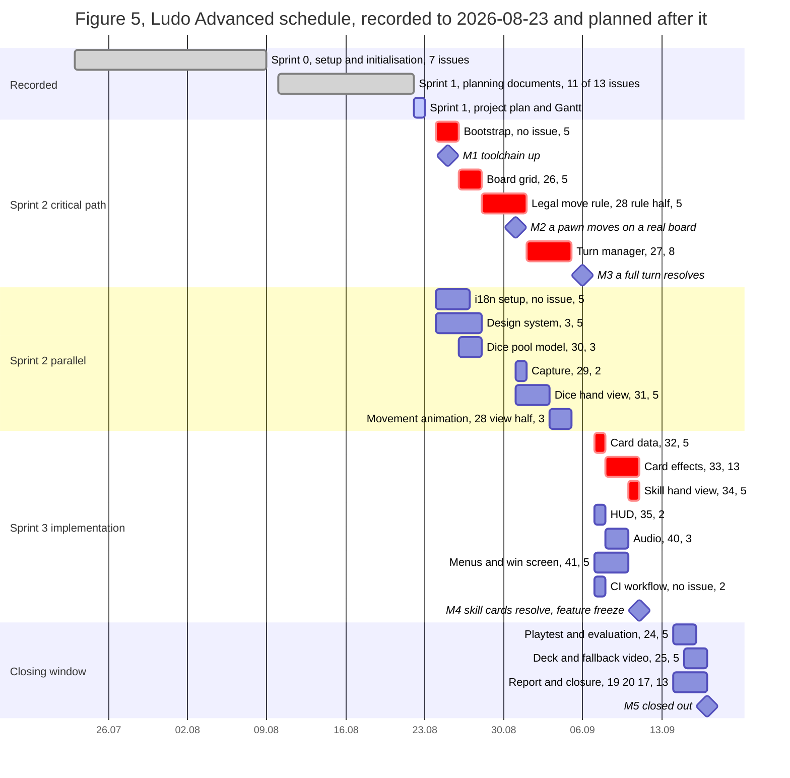

# Roadmap and Gantt chart

The project schedule as a Gantt chart, and the record of the board view it is supposed to come from.

Issue #18 says "Creation in Github", so the deliverable is the **Roadmap view of the GitHub Projects
board** plus the document that says how it is configured and what it can and cannot show. This
document is that record, and it also carries a second Gantt chart drawn in Mermaid, for the reason in
section 3: the board view cannot currently be configured or exported, and a schedule that exists only
inside a web UI is not a schedule the report can print.

---

## 1 The Roadmap view as it exists

Read on 2026-08-22 with `gh api graphql` against user project 3, so these are measured values and not
a description of intent.

| Property | Value |
| --- | --- |
| Project | *Ludo Advanced*, user-level project 3 of `BenedictGlatz` |
| View | number 1, named `Roadmap` |
| Layout | `ROADMAP_LAYOUT` |
| Filter | empty, so the view shows all 64 items |
| Date fields available | `Start Date` and `End Date`, both `DATE`, both custom |

**Three things about this view are not readable through the API**, and they matter, so they are named
rather than guessed at:

- **Which date fields the bars are actually bound to.** A roadmap layout can be driven by any pair of
  date fields, and the GraphQL API exposes the view's layout and filter but not its date-field
  binding. `Start Date` and `End Date` are the only date fields on the board, so they are almost
  certainly the pair, and "almost certainly" is what this document can honestly say.
- **The zoom level** (month, quarter, year). Not exposed either. The sprint span is 2026-07-23 to
  2026-09-17, so **month** is the level at which the whole project fits on one screen, and that is a
  recommendation rather than an observation.
- **The grouping.** Grouping by `Sprint` is what makes the view read as a Gantt chart with one lane
  per sprint. Not exposed, and not settable by an agent, see section 3.

## 2 What the view can show today, measured

`Start Date` and `End Date` are populated on **11 of 64 board items**:

| Items with dates | Count | What the Roadmap draws |
| --- | --- | --- |
| The 4 sprint-marker draft issues | 4 | Four bars, 2026-07-23 to 2026-09-17. These are the only real bars on the chart. |
| The 7 `Sprint 0` issues | 7 | Seven **zero-length** bars. Every one has `Start Date` equal to `End Date`, so each renders as a point rather than a span. |
| Everything else | 53 | Nothing. Items with no dates do not appear on a roadmap layout at all. |

**So the Roadmap view currently shows 4 bars and 7 dots, out of 64 items.** That is the finding, and
it is the reason issue #18 cannot be closed by taking a screenshot of the view as it stands.

Three specific gaps behind that number:

1. **All 13 `Sprint 1` issues have no dates.** They are the sprint's entire delivered scope, and none
   of it appears on the chart. The 2026-08-22 board read recorded this as a change: dates used to be
   populated on all 50 items in the older, smaller item set and are not populated on the current one.
2. **The 4 sprint markers carry no `Sprint` value of their own**, so a view grouped by `Sprint` puts
   the four bars that define the schedule in a no-sprint lane, separate from the issues they contain.
3. **The Sprint 0 dates are single-day**, which reads as "the day the issue was closed" rather than
   as a work span. One of them, *Role Setup and Process Model*, is dated 2026-08-01, five days before
   the repository was created. Useful as a record of when something was ticked off, not useful as a
   Gantt bar.

## 3 Why the chart below exists as well

**The board view cannot be configured from here, and it cannot be exported at all.**

- **Configuring it needs the `project` token scope**, which the `gh` token does not carry. It has
  `gist`, `read:org`, `read:project`, `repo` and `workflow`. So the view's grouping, its zoom and its
  date-field binding are readable at best and not writable, and filling `Start Date` and `End Date`
  on the 13 Sprint 1 issues fails for the same reason. This is the third thing blocked on the same
  one-time interactive `gh auth refresh -s project`, after the `Story Points` field and the `Sprint`
  assignment of [Project-Plan.md](Project-Plan.md) section 4.4.
- **A GitHub Projects view has no export.** It can be screenshotted, and a screenshot is a binary
  file that does not diff, goes stale the moment a date changes, and has to be retaken by hand every
  time. The report needs a figure it can print; the project needs a schedule it can review in a pull
  request. A screenshot is neither.

So the Gantt chart is drawn in **Mermaid, in this file**, the same decision already taken for the two
architecture figures: GitHub renders it inline, it stays a text diff in review, and the report exports
it as an image at the end. The board's Roadmap view stays the live tracking surface for the team, and
this chart is the printable and reviewable one. **The two can disagree**, and if they do this file is
wrong and gets corrected, because the board is the single source of truth for sprint membership.

## 4 The chart

Dates from the board's sprint markers for Sprint 0 and Sprint 1, and from sections 2.2, 2.3 and 4.4
of [Project-Plan.md](Project-Plan.md) for everything after 2026-08-24. Points per item from
[Effort-Estimation.md](Effort-Estimation.md).

**Read the two halves differently.** Sprint 0 and Sprint 1 are **recorded**: they happened, and the
bars are what the board says. Sprint 2 and Sprint 3 are **planned**, and no issue on the board yet
carries a date or a sprint for any of it.

Bars marked as critical are the chain of
[Project-Plan.md](Project-Plan.md) section 4.3: bootstrap, #26, the rule half of #28, #27, #32, #33,
#34, 46 points that cannot be parallelised. The *Sprint 2 parallel* and the unmarked Sprint 3 bars are
the 32 points that can run beside it, which is the whole of the schedule's slack.

## 5 What this chart deliberately does not claim

- **The bars after 2026-08-24 are a plan, not board state.** No implementation issue carries a
  `Start Date`, an `End Date` or a `Sprint` value. Section 4.4 of the project plan assigns them and
  that assignment is blocked on the `project` token scope, so the board and this chart disagree until
  someone does that one manual step. **The board wins**, by the 2026-08-22 decision, and this file is
  what gets corrected.
- **The extended features #42 to #46 have no bars at all**, 34 points of `should have` and `could
  have` work. That is deliberate: they are unscheduled, and drawing them would imply a commitment the
  drop order of [Requirements-Specification.md](Requirements-Specification.md) section 3.3 explicitly
  does not make.
- **The bar widths are not durations.** They are a sequence with dates attached, derived from
  dependency order and point size, and the project decided against hour-level tracking on 2026-08-06.
  A 13-point item drawn across 3 days is a claim about order, not about effort per day.
- **Sprint 3's implementation half is overloaded and the chart shows it.** 35 points across 5
  weekdays, against a required average of 4.9 per weekday. The bars overlap heavily there because
  they have to, which is what an unachievable plan looks like when it is drawn instead of totalled.
  Section 5.3 of the project plan rates the resulting risk a 5, the highest in the register.
- **Sprint 0's 7 single-day bars are not corrected** to spans. They record when something was closed,
  which is what the board holds, and inventing a start date for each would be inventing data.

## 6 Outstanding actions

1. **One interactive `gh auth refresh -s project`.** It unblocks four things: the `Story Points`
   field, the `Sprint` assignment, moving board cards, and everything in the next two items.
2. **Fill `Start Date` and `End Date` on the 13 Sprint 1 issues**, retroactively and honestly: the
   sprint's start for the five closed early in it, and 2026-08-22 for the six delivered on that day.
   Six issues sharing one date is the fact and should be visible on the chart, not smoothed into a
   plausible spread.
3. **Set the Roadmap view's grouping to `Sprint` and its zoom to month**, and record the values here
   once they can be read back rather than assumed.
4. **Take one screenshot of the Roadmap view** once items 2 and 3 are done, and register it as
   **Figure 6** in [notes/12-appendix.md](../Documentation/notes/12-appendix.md). It is reserved
   there and cannot be produced from the command line, so it is a human step by nature and not by
   the token scope.
5. **Give the 4 sprint markers a `Sprint` value of their own**, so that a view grouped by `Sprint`
   puts each sprint's bar in the lane of its own issues instead of in a no-sprint lane.
