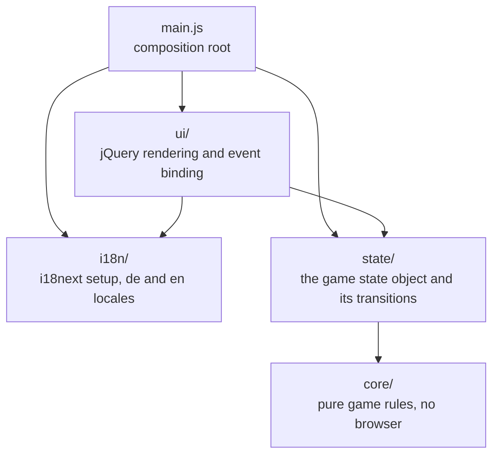
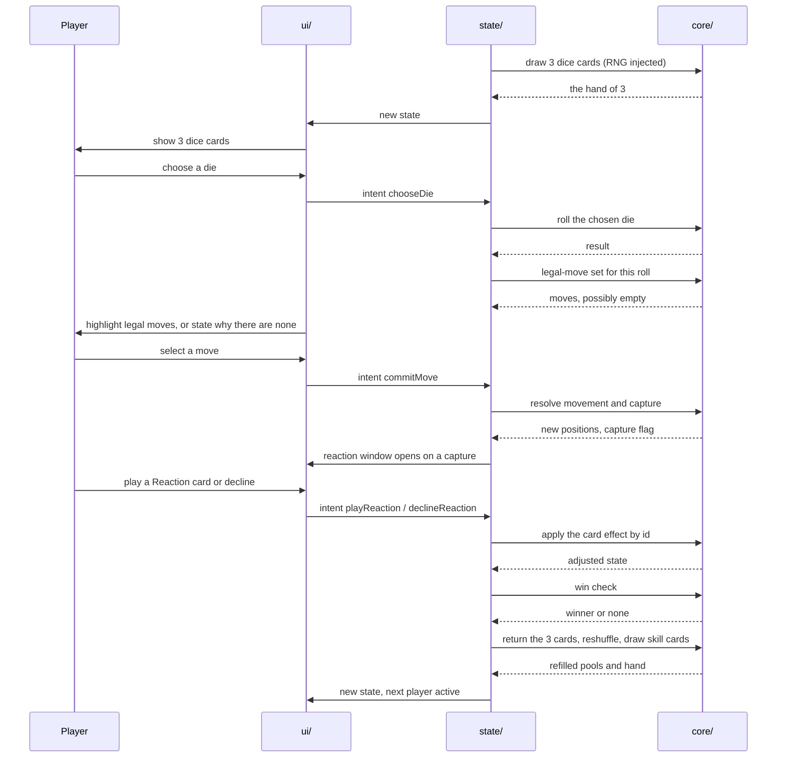

# System Architecture

The structure of the source code of Ludo Advanced: which layers exist, what each one owns, how a
player action travels through them, and why the layering is cut this way rather than another.

This document describes the **target state**. The repository contains no source code yet: no
`package.json`, no `src/`. Every statement below is therefore a design commitment taken from
[CLAUDE.md](../../CLAUDE.md) and from the requirements it has to satisfy, not an observation of
running code. The chapter notes 04, 05 and 06 fill with observed facts when the code exists.

The rules this architecture serves are in [Game-Design-Document.md](Game-Design-Document.md); the
requirements it is measured against are in [Requirements-Specification.md](Requirements-Specification.md),
above all NFR-01 (the layering), NFR-02 (the 300-line limit), NFR-05 (the coverage target) and
NFR-09 (the injectable RNG).

---

## 1 The layers

Five units, four of them directories and one a file:

*Figure 2: Layer structure of Ludo Advanced and the permitted import directions.*

**The two hard rules are the edges that are not drawn**, and they are the whole point of the diagram:

- **`core/` imports nothing from `state/` or `ui/`.** There is no arrow leaving `core/`. The rules
  are a function of their arguments and of nothing else.
- **`ui/` never mutates state.** There is no arrow from `ui/` into `core/` either, and the arrow into
  `state/` carries intents, not writes. `ui/` reads state and dispatches; `state/` decides.

Both are stated as requirement NFR-01 with an acceptance criterion that is mechanically checkable:
unit tests for `core/` run with no DOM environment configured. A violation of the first rule is
therefore not a style complaint, it is a failing test.

| Layer | Owns | Must not contain |
| --- | --- | --- |
| `core/` | Board topology, movement, capture, win conditions, the dice card pool, the skill card pool, effect resolution, the turn rules | DOM, jQuery, i18next, imports from `state/` or `ui/` |
| `state/` | The single game state object, the transitions that change it, the turn manager driving the sequence, the intent handlers | Rules of its own, rendering |
| `ui/` | Rendering the board, pawns, hands and prompts; binding events; dispatching intents | Game rules, direct state mutation |
| `i18n/` | i18next setup, `locales/de.json`, `locales/en.json` | Anything else |
| `main.js` | Composition root: boots i18next, wires core, state and ui together | Rules, rendering, state |

---

## 2 Module inventory

Derived from the functional requirement blocks rather than invented: each module below owns one block
of [Requirements-Specification.md](Requirements-Specification.md), so a requirement has one obvious
home and a rule change has one obvious file.

### 2.1 `core/`

| Module | Responsibility | Requirements |
| --- | --- | --- |
| `board.js` | The topology as data and the position arithmetic over it: 52 shared squares, entry and turn-off square per player, the 5-square home column, the relative position `r` from 0 to 58. | FR-02, FR-08 |
| `movement.js` | The legal-move set for a player and a roll: leaving the start area on the maximum, advancing, the own-pawn rule, the exact count into home. | FR-09, FR-10, FR-12, FR-13, FR-14 |
| `capture.js` | Capture resolution: which pawn is sent back, and where it lands. | FR-11, FR-15 |
| `dice-pool.js` | The pool composition as data, the draw of 3, the roll of the chosen die, the return and reshuffle. Takes the RNG as an argument. | FR-16 to FR-21, NFR-09 |
| `skill-pool.js` | The skill card pool, the draw rule, the hand limit, the discard and reshuffle. | FR-22, FR-27, FR-28 |
| `card-effects.js` | One pure function per card id, each a transformation of game state. Playability predicates for Action and Reaction cards. | FR-23, FR-24, FR-26 |
| `turn-rules.js` | The rules of the turn that are not movement: what closes a turn, when a reaction window opens, when a turn passes with no legal move. | FR-14, FR-25 |
| `win.js` | Win detection: all four pawns of one player at `r = 58`. | FR-05 |

Every module in this list is a function of its arguments. That is what makes the coverage target of
NFR-05 reachable: there is no browser to start and no state to set up beyond the arguments themselves.

### 2.2 `state/`

| Module | Responsibility | Requirements |
| --- | --- | --- |
| `game-state.js` | The single state object: players, pawn positions, whose turn it is, the drawn dice cards, each hand, the pools, the phase of the turn. The only writable source of truth. | FR-01, FR-04 |
| `turn-manager.js` | Drives the 8-step turn sequence of the game design document, including the reaction window as a phase of the turn rather than as a special case. | FR-04, FR-18, FR-21, FR-25 |
| `intents.js` | The intent vocabulary `ui/` may dispatch: choose a die, select a pawn, commit a move, play a card, decline a reaction, end the turn. Each intent validates against `core/` before anything is written. | FR-19, FR-23, FR-24, FR-32 |
| `match.js` | Match lifecycle: start with 2 to 4 players, restart, abandon. | FR-01, FR-06, FR-07 |

### 2.3 `ui/`

| Module | Responsibility | Requirements |
| --- | --- | --- |
| `board-view.js` | Renders the track, the start areas, the home columns and the pawns from state. | FR-31 |
| `dice-hand-view.js` | Renders the 3 drawn dice cards and the choice, and the roll result. | FR-31, FR-33 |
| `skill-hand-view.js` | Renders the active player's skill hand and the reaction prompt. | FR-31, FR-24 |
| `move-hints.js` | Highlights the legal-move set before the player commits, and shows the stated reason when a move is refused. | FR-32, NFR-08 |
| `hud.js` | Per-player progress: pawns in start, on track, home. | FR-36 |
| `screens.js` | Main menu, pause, win screen and the flow between them. | FR-38, FR-05 |
| `events.js` | The single place jQuery event handlers live. Each handler translates a DOM event into one intent and dispatches it. Nothing else. | NFR-01 |

`ui/` is covered by Playwright rather than by unit tests, which is why the coverage target names only
`core/` and `state/`. A line-coverage number for `ui/` would measure how much jQuery ran, not whether
anything works.

---

## 3 Data flow

One player action, from click to redraw. This is the loop every feature goes through, and there is no
second path:

1. **Event.** `ui/events.js` receives a jQuery event, for example a click on a dice card.
2. **Intent.** The handler translates it into one intent and dispatches it into `state/`. It does not
   decide whether the action is allowed, and it writes nothing.
3. **Rule check.** `state/` asks `core/` whether the intent is legal, passing the current state and
   the intent as arguments. `core/` answers and changes nothing.
4. **Transition.** If it is legal, `state/` applies the transition and produces the new state. This is
   the only place in the program where game state is written.
5. **Render.** `ui/` re-renders from the new state. It reads; it does not derive rules while rendering.

**Why the check and the write are separate steps.** The same rule function that answers "is this move
legal" is the one that produces the highlighted legal-move set for FR-32. If the check lived in
`state/` alongside the write, the on-screen hints and the actual validation would be two
implementations of one rule, which is exactly the class of bug that makes a player distrust the board.

---

## 4 The turn as a sequence

The same eight steps as section 3 of [Game-Design-Document.md](Game-Design-Document.md), drawn as the
interaction between the layers. The rules layer never appears as an initiator: every arrow into
`core/` is a question, and every arrow out of it is an answer.

*Figure 3: One turn as an interaction between the layers.*

Two things the diagram is meant to make obvious:

- **The reaction window is a phase of the turn**, held by `state/turn-manager.js`, and not an event
  the cards raise on their own. That follows from FR-25 being a requirement on the turn manager, and
  it is what keeps the interruption bounded and testable.
- **The RNG enters from outside.** `core/dice-pool.js` receives it as an argument (NFR-09), so a test
  supplies a fixed sequence and asserts an exact board state. Nothing in `core/` reads
  `Math.random()` directly.

---

## 5 Why this layering

Three reasons, each of them a consequence the project already has to deliver rather than a general
principle.

**It is what makes the coverage target readable.** NFR-05 asks for at least 80 % line coverage in
`core/` and `state/`. Both layers are free of the DOM, so their tests are function calls: no browser
to start, no fixture beyond the arguments. With rules interleaved into rendering, the same 80 % figure
would be a number nobody could produce, and the goal it belongs to would be unmeasurable by
construction rather than unmet.

**It is what makes the 300-line limit survivable.** NFR-02 caps every file at 300 lines. A rule, its
state transition and its rendering are three concerns of very different size: movement is
arithmetic-heavy, its view is markup-heavy. Split by layer, each file stays inside the limit for a
reason. Kept together, a mechanic's file would grow past 300 lines and the only remaining way to obey
the limit would be to cut it at an arbitrary point.

**It is what keeps a rule change cheap.** The eight rules of section 6 of the game design document are
unsigned by the Product Owner, so at least some of them will change. A change to the exact-count rule
touches `core/movement.js` and its unit test. It does not touch a view, because no view knows the
rule: the views read the legal-move set that `core/` produced.

**Rejected: game rules inside jQuery event handlers**, which is the natural shape of a jQuery
application and the reason the rule is written down at all. A click handler that reads the board,
decides whether the move is legal, moves the pawn and updates the markup is the shortest path to a
playable prototype. It loses on all three counts above: the rule cannot be tested without a DOM, the
handler file grows past the line limit as mechanics accumulate, and a rule change means editing
markup. It also duplicates every rule, once for the legal-move highlighting of FR-32 and once for
validation on commit.

**Rejected: a fourth layer between `state/` and `core/`**, a service or use-case layer of the kind a
larger application would have. With four modules in `state/` and no backend, no persistence beyond the
session and no networking in the MVP, it would add a hop that forwards calls unchanged. The layering
is cut to the size of this application, and the note is here so that the absence reads as a decision.

---

## 6 What this document does not decide

- ~~**Nothing here is verified.** There is no `src/`, so the module inventory is a plan.~~
  **Verified 2026-08-30.** All four layers exist and a match can be played end to end in a browser.
  What the plan got right and wrong, recorded rather than quietly fixed:

  | Claim | Outcome |
  | --- | --- |
  | `core/` never imports `state/`, `ui/`, jQuery or i18next | **Held.** It is a failing ESLint run since 2026-08-29, not a convention |
  | `core/` and `state/` run with no DOM configured at all | **Held.** Vitest runs them in `environment: "node"` |
  | `ui/` never mutates state | **Held, and enforced rather than reviewed.** Every state object is deeply frozen, so a write throws in the line that did it |
  | `ui/` dispatches intents and nothing else | **Held.** Four intents, and `ui/` never builds a move object of its own |
  | The layering makes a rules change cheap | **Measured.** Changing the board from 52 squares to 40 on 2026-08-30 needed two constants in `board.js` and comment changes in four other modules. No rule was rewritten |
  | `ui/` is not worth a coverage figure | **Half wrong.** One module in `ui/` turned out to be a pure lookup table with a silent failure mode, and it is unit tested. The rest is Playwright's |

  **The module split changed in two places.** `core/` gained `dice-source.js`, which the inventory
  did not name, because the turn manager could not be written without something to draw from before
  issue #37 exists. `ui/` came out as five modules rather than the three the sprint plan listed:
  `board-geometry.js` separated from `board-view.js` because grid arithmetic is testable without a
  browser and rendering is not, and `game-loop.js` separated from `main.js` because deciding what the
  view does between clicks is presentation policy and not composition.
- **File-level splits inside a layer may change.** The inventory names the seams the requirements
  imply; if `core/movement.js` approaches 300 lines it splits again, along a real seam and not by
  cutting it at line 300. **This happened first to a stylesheet rather than to a module**, on
  2026-08-30: `board.css` was delivered at 248 lines, the formatter expanded it to 407, and the 40
  track placements moved to `board-track.css`.
- ~~**No presentation decision.** How the board is drawn, in SVG, in a CSS grid or in `<canvas>`, is
  not settled here. It belongs to Claude Design and issue #3, and picking one in this document would
  be inventing a design rule that [CLAUDE.md](../../CLAUDE.md) forbids.~~
  **Settled 2026-08-29, and this deferral was over-cautious: the board is real DOM elements laid out
  by CSS Grid.** SVG and `<canvas>` are the named rejected alternatives; the reasoning is the
  2026-08-29 decision block in
  [project-journal.md](../Documentation/project-journal.md). The correction worth recording is *why
  the deferral was wrong*: `CLAUDE.md` forbids inventing colour palettes, spacing scales, typography
  systems and component looks, and a rendering technology is none of those. It decides what a
  stylesheet can address, not what anything looks like. It also could not be deferred any further in
  practice, because the design handoff of issue #3 cannot pass over a DOM contract without first
  deciding that there is a DOM.
- **No deployment target.** The build is a static `dist/` (NFR-06), and where it is served from is
  undecided. Named as undecided in the obligations book, issue #14.
- **No multiplayer architecture.** FR-42 is `should have` and has no chosen networking technology, so
  the layering above describes a local hot-seat game only (FR-03). Where a network layer would attach
  is a real design question and is deliberately not answered from guesswork.
