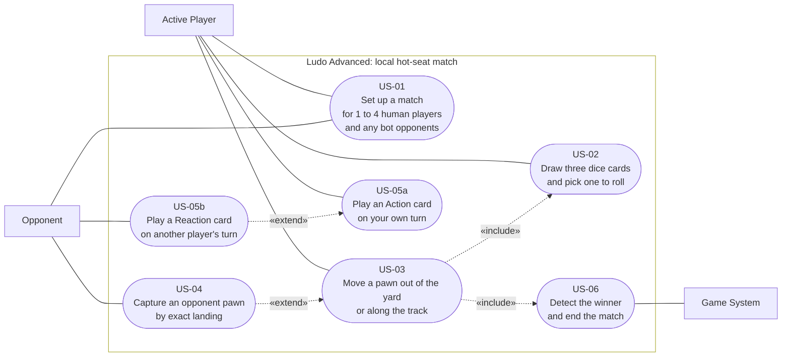

# Use Cases and User Stories

The six use cases of a local Ludo Advanced match, drawn as a use case diagram and written out as
agile user stories. This is the source for section 3.1 of the report.

**Why this document exists.** Until 2026-09-04 the project had a requirements specification
([Requirements-Specification.md](Requirements-Specification.md), FR-01 to FR-45) but no user stories
at all, and the open-questions list in
[notes/01-requirements-and-goals.md](../Documentation/notes/01-requirements-and-goals.md) said so.
A draft of report section 3.1 nevertheless referenced US-01 to US-06. Those identifiers pointed at
nothing. This document defines them, so that the report's references resolve against a real artefact
instead of against prose written from memory.

**What this document is not.** It is not a second requirements source. The binding acceptance
criteria stay in the FR table, and every story below traces to the FRs it summarises. A story and its
FRs can therefore not drift apart, because the story deliberately does not restate the criteria: it
points at them. When a rule changes, the FR row changes and the story keeps pointing at the correct
rule.

---

## 1 Actors

| Actor | Kind | Who this is |
| --- | --- | --- |
| **Active Player** | primary | The player whose turn it currently is. Drives the whole turn cycle. |
| **Opponent** | primary | Any other seated player. Passive for most of a turn, but acts through Reaction cards (FR-24, FR-25) and is the target of a capture. |
| **Game System** | secondary | Ludo Advanced itself, where it acts without a player asking it to: shuffling, rolling, continuously checking the win condition, and taking the turns of any bot opponent. |

The MVP is hot-seat (FR-03): all three actors sit at one device and one browser tab. There is no
network actor, no server and no account. Online play is FR-42 and out of scope for this diagram.

**A bot opponent is not a fourth actor.** An actor is external to the system, and a bot is the system
playing a seat. A bot therefore occupies a seat created in US-01 and takes its turns through the Game
System, which is why the diagram gains no oval and no box when bots are switched on. The human
**Opponent** actor is the one that disappears at a single-player table, not the seat.

---

## 2 Figure: use case diagram of a local match

**Two notes on the Mermaid source**, because both look like omissions and are not. The system
boundary is styled `fill:none`: a filled cluster is painted on top of the lines running from the
actors into it, so with a fill the three actors appear connected to nothing. And the subgraph carries
no `direction`, because Mermaid ignores a subgraph's direction as soon as edges cross the cluster
border, which every actor association here does. Setting it would suggest control over a layout that
Mermaid decides on its own.

**Figure: Use cases of a local Ludo Advanced match.** Stadium shapes are use cases, boxes are actors,
the frame is the system boundary. Solid lines are associations, dotted arrows are UML relationships
and point from the dependent use case to the one it depends on.

**How to read the four dotted arrows**, because they carry the actual turn logic:

- **US-03 «include» US-02.** A move can only happen after a die has been picked and rolled. The
  inclusion is unconditional: there is no path to moving a pawn that skips the dice card step.
- **US-03 «include» US-06.** Every completed move is followed by a win check. The check is part of
  moving rather than a step a player triggers, which is why the Game System and not the Active Player
  is attached to US-06.
- **US-04 «extend» US-03.** A capture is not a separate player action. It is what a move turns into
  when the target square happens to hold an opponent's pawn, so it extends the move rather than being
  included by it.
- **US-05b «extend» US-05a.** A Reaction is triggered by another player's action, so it hangs off the
  action rather than standing alone. This is the reaction window of FR-25.

**US-05a and US-05b are one story in the report**, cited jointly as US-05. They are split in the
diagram because Action and Reaction cards have different actors and different timing, and drawing
them as one oval would hide exactly the relationship that makes the skill card system interesting.

---

## 3 The stories

Written in the standard form: as a *role*, I want *capability*, so that *benefit*. The rightmost
column is the trace into [Requirements-Specification.md](Requirements-Specification.md), where the
testable acceptance criteria live.

| ID | User story | Traces to |
| --- | --- | --- |
| **US-01** | As a **player or group of players**, we want to configure a match for one to four human participants and fill any remaining seats with bot opponents, so that everyone at the table gets a seat with its own colour, start area and home path, and so that a single player can still play a full game alone. | FR-01 †, FR-02, FR-03, FR-04, FR-43 † |
| **US-02** | As the **active player**, I want to draw three dice cards and pick one of them to roll, so that I can weigh the chance of rolling the maximum against the size of the move I would get. | FR-16, FR-18, FR-19, FR-20, FR-21 |
| **US-03** | As the **active player**, I want to choose which eligible pawn moves after the roll resolves, so that I decide between bringing a new pawn out of the yard and advancing one already on the track. | FR-09, FR-10, FR-12, FR-13, FR-14, FR-32 |
| **US-04** | As the **active player**, I want to send an opponent's pawn back to its yard by landing exactly on its square, so that the board stays contested and a lead can be taken away. | FR-11, FR-15 |
| **US-05a** | As the **active player**, I want to play an Action card during my own turn, so that I can change the board beyond what the die alone allows. | FR-22, FR-23, FR-26, FR-27, FR-28 |
| **US-05b** | As an **opponent**, I want to play a Reaction card while another player acts, so that I can defend a vulnerable pawn instead of only watching. | FR-24, FR-25, FR-26, FR-27 |
| **US-06** | As a **player**, I want the game to recognise the moment my fourth pawn reaches home and show a game-over screen, so that the match ends by itself and the winner is unambiguous. | FR-05, FR-38 |

**† US-01 is ahead of the specification, deliberately.** FR-01 currently reads "a player count chosen
from 2, 3 or 4" and is a must-have; bot opponents are FR-43, priority `C`, filed under *Beyond the
MVP*. A single-player match is only playable if something takes the other seats, so US-01 as written
above depends on a `could have` requirement. Two rows therefore have to move before this story is
buildable: FR-01 has to admit a count of 1, and FR-43 has to rise out of `C`. Until that happens the
lower bound of 1 is an **intent recorded here, not an agreed requirement**, and it is tracked in
section 5.

### Why the trade-off in US-02 is the central one

US-02 is the story the whole design turns on, and it is worth stating why rather than leaving it as a
mechanic. A pawn leaves the yard only on the die's **maximum** face (FR-09). A D2 leaves the yard
half the time but moves at most two squares; a D20 moves up to twenty squares but leaves the yard
once in twenty. Every turn therefore poses the same question in a different shape, and the three
cards drawn are the options the player gets to answer it with. Classic Ludo has one die and no
question. This is where the "advanced" in the title actually sits.

---

## 4 What the diagram leaves out, and why

A use case diagram that draws everything stops being readable, so three things were left out
deliberately.

- **Screens and navigation** (FR-38: main menu, pause, win screen). These are how the use cases are
  reached, not use cases themselves. Drawing "open the pause menu" as an oval would put interface
  navigation on the same level as capturing a pawn.
- **Locale switching** (FR-34) and **audio** (FR-39 to FR-41). Both are cross-cutting: they apply
  during every use case rather than being one of them. FR-34 in particular is a must-have and its
  absence from the diagram is not a statement about its priority.
- **Everything beyond the MVP except bots** (FR-42, FR-44, FR-45: online play, rule toggles, reload
  survival). Drawing planned scope next to shipped scope makes a diagram that reads as a promise.
  Bot opponents (FR-43) are the one exception, because US-01 now needs them for its lower bound of a
  single human player, and because they add no oval to the diagram anyway.

**Trap cards** (FR-30) are also absent as their own oval. A trap is laid by playing an Action card
and fires without anybody acting, so it sits inside US-05a and US-03 rather than beside them.

---

## 5 Status

Written 2026-09-04, after the fact. These stories were **reconstructed from the requirements
specification**, not used to derive it, and that ordering is worth naming rather than hiding: the
project wrote FRs first and user stories second. The honest consequence is that the stories add
readability and a report section, but they added no requirement that the FR table did not already
carry. Nothing was discovered while writing them.

The Product Owner has not signed these off. Sign-off belongs with the Game Design Document's table in
section 9 of [Game-Design-Document.md](Game-Design-Document.md).

### Open: US-01 and FR-01 disagree about the minimum player count

Raised 2026-09-04, unresolved. US-01 above says **1 to 4** human players with bots filling the rest.
FR-01 says **2, 3 or 4** and does not mention bots at all. They cannot both be right, and the story
is the newer of the two.

Resolving it is a scope decision and not a wording fix, because a single-player seat is only playable
if bots exist:

- **FR-01** has to change its lower bound from 2 to 1 and state what happens to the unfilled seats.
- **FR-43** (*LLM-powered bot opponents*, currently `C`, issue #43) has to rise to at least `S`.
  A `could have` that a `must have` depends on is a broken dependency: if FR-43 is cut, FR-01's new
  lower bound becomes unbuildable.
- The **acceptance criterion of FR-03** ("a match completes with 4 players without any network
  connection") stays valid, but an LLM-backed bot needs a network call, so either the bot is local
  and rule-based or FR-03 gains an exception. That is a third decision hiding behind the first two.

Neither file was edited, because moving a must-have's bound and promoting a could-have is the Product
Owner's call, not a documentation edit. Until it is made, treat the lower bound of 1 in US-01 as
recorded intent.

**Resolved 2026-09-04, later the same day.** The Product Owner asked for the bot to be built, which
settled all three questions at once and in the direction this section had guessed:

1. **FR-01's lower bound is 1 person**, and it now says what happens to the unfilled seats: they are
   played by bots.
2. **FR-43 rose to `S`** and was rewritten as *local, rule-based* bot opponents. FG-18 was reworded and
   raised with it.
3. **FR-03 is untouched and still valid**, because the third decision went the way that costs nothing:
   the bot is local. The LLM idea was dropped rather than given an exception, and the contradiction it
   would have created with FR-03's "without any network connection" is the reason.

The bot shipped the same day (issue #43). What is still open is **how a player chooses one**: today it
is `?bots=` in the address bar, and a setup screen is a separate issue waiting on D86 of design brief 13.
