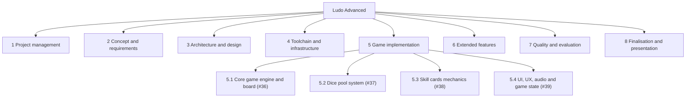

# Project Structure Plan (PSP)

The complete decomposition of Ludo Advanced into subprojects and work packages, and the rule for
where every new piece of work belongs. Deliverable of issue #17.

This document answers one question: **what does the project consist of, exactly once each?** It
deliberately answers nothing else. What a work package costs is in
[effort-estimation.md](effort-estimation.md), when it runs is on the board and in section 4.4 of
[project-plan.md](project-plan.md), what it depends on is in section 4.1 of the same plan, and who
owns it is in section 3.2 there. Repeating any of those columns here would create a second copy that
drifts, which is the same single-source argument the sprint log already applies to sprint membership.

---

## 1 Method

### 1.1 Decision: the plan adopts the board's tree instead of inventing one

**Decided: the work breakdown is the backlog itself.** The implementation branch of the tree below
is the board's own epic and sub-issue graph, read on 2026-08-22, and every other branch groups the
remaining board issues by the kind of deliverable they produce.

This was already argued once, from the other side: section 2 of
[effort-estimation.md](effort-estimation.md) used the backlog as its structure basis because this
plan did not exist yet, and stated that when #17 is written it "should adopt this tree rather than
invent another, and this document is then its cost column". That is what happens here. The epic
structure was read from the board's sub-issue graph rather than inferred from titles, and it matches
the requirement blocks of [requirements-specification.md](requirements-specification.md) section 4
exactly, so a different tree would have to be worse.

Two alternatives were rejected:

- **A freely designed product tree.** The textbook approach, and wrong here, because the board
  already is the team's working structure. A second tree with different cuts would force every issue
  to be mapped twice and would drift from the board with the first new issue.
- **A phase-oriented decomposition** along the existing labels `2-definition` to `5-completion`.
  The labels classify issues by lifecycle stage, they do not structure the product: a phase tree
  would tear each epic apart across three phases and would say nothing about what the game consists
  of. The phases stay what they are, a label dimension across the tree, not the tree.

### 1.2 Coding scheme

- The root is the project. Subprojects are numbered **1** to **8**, work packages **X.Y**, and the
  children of an implementation epic **X.Y.Z**.
- **A work package is a leaf.** The four epics #36 to #39 are structure nodes, not work packages:
  they carry no deliverable of their own, which is the same reason they carry no points in the
  effort estimation.
- Where a work package has a board issue, the issue is named in the row and the issue is the work
  package's identity: board first, code second. Three work packages have **no board issue**; they
  are the three items section 3.6 of [effort-estimation.md](effort-estimation.md) found invisible
  to the board, marked *(no issue)* below, and creating their issues is already an outstanding
  action there.

### 1.3 What a row carries

Code, name, owning issue, board status as read on 2026-08-22, and the deliverable's location. No
points, no dates, no owner and no MoSCoW class, for the single-source reason above. The status
column is a dated snapshot, not a live view: the board is the live view.

---

## 2 The tree

Figure 7. The diagram shows the tree to epic level; the tables in section 3 are the normative,
complete inventory of the leaves.

---

## 3 Work packages

### 3.1 Subproject 1: Project management

The management deliverables. The **standing process activities are deliberately not work packages**:
sprint ceremonies, board upkeep, the AI prompt log, the changelog and the documentation notes are
per-change obligations bound by `CLAUDE.md`, not schedulable packages with an end. A work package
named "do the process" would be done only when the project is, which is no information.

| Code | Work package | Issue | Status 2026-08-22 | Deliverable |
| --- | --- | --- | --- | --- |
| 1.1 | Role setup and process model | #5 | closed | [one-pager.md](one-pager.md), [github-project.md](github-project.md) |
| 1.2 | RACI matrix | #6 | closed | [stakeholder-analysis.md](stakeholder-analysis.md), whose RACI table is still empty |
| 1.3 | Kickoff | #7 | closed | [meeting-notes/2026-08-06.md](meeting-notes/2026-08-06.md) |
| 1.4 | Stakeholder analysis | #8 | closed | [stakeholder-analysis.md](stakeholder-analysis.md) |
| 1.5 | Risk analysis | #11 | closed | [risk-analysis.md](risk-analysis.md) |
| 1.6 | Project plan: time, resources, risks | #15 | closed | [project-plan.md](project-plan.md) |
| 1.7 | Effort estimation | #16 | closed | [effort-estimation.md](effort-estimation.md) |
| 1.8 | Project structure plan | #17 | open | this document |
| 1.9 | Gantt diagram via Roadmap | #18 | closed | [roadmap-and-gantt.md](roadmap-and-gantt.md) |
| 1.10 | Project closure report | #20 | open | not yet written |

### 3.2 Subproject 2: Concept and requirements

What the game is and what it must do.

| Code | Work package | Issue | Status 2026-08-22 | Deliverable |
| --- | --- | --- | --- | --- |
| 2.1 | One pager | #1 | closed | [one-pager.md](one-pager.md) |
| 2.2 | SMART analysis | #9 | closed | [smart-analysis.md](smart-analysis.md) |
| 2.3 | Functional and non-functional goals | #10 | closed | [functional-and-non-functional-goals.md](functional-and-non-functional-goals.md) |
| 2.4 | Utility value analysis | #47 | closed | [utility-value-analysis.md](utility-value-analysis.md) |
| 2.5 | Feasibility study | #12 | closed | [feasibility-study.md](feasibility-study.md) |
| 2.6 | Requirements specification and MoSCoW analysis | #13 | closed | [requirements-specification.md](requirements-specification.md) |
| 2.7 | Game design document | #22 | closed | [game-design-document.md](game-design-document.md) |

### 3.3 Subproject 3: Architecture and design

How the game is built and how it looks, before any of it exists in code.

| Code | Work package | Issue | Status 2026-08-22 | Deliverable |
| --- | --- | --- | --- | --- |
| 3.1 | System architecture diagram | #21 | closed | [system-architecture.md](system-architecture.md) |
| 3.2 | Obligations book | #14 | closed | [obligations-book.md](obligations-book.md) |
| 3.3 | Design system | #3 | open | developed with Claude Design, not yet started |

### 3.4 Subproject 4: Toolchain and infrastructure

Everything the implementation runs on. Three of the five packages have no board issue; they are the
12 points of must-have work section 3.6 of [effort-estimation.md](effort-estimation.md) found the
board does not show.

| Code | Work package | Issue | Status 2026-08-22 | Deliverable |
| --- | --- | --- | --- | --- |
| 4.1 | GitHub setup and documentation | #2 | closed | repository, board, `README.md` |
| 4.2 | CLAUDE.md and coding standards | #4 | closed | `CLAUDE.md` |
| 4.3 | Project bootstrap: `package.json`, Vite, ESLint, Prettier, Vitest, Playwright, the npm scripts | *(no issue)* | not started | `package.json` and the config files |
| 4.4 | i18n setup and the two locale files | *(no issue)* | not started | `src/i18n/`, `locales/de.json`, `locales/en.json` |
| 4.5 | CI workflow | *(no issue)* | not started | `.github/workflows/build-check.yml` |

### 3.5 Subproject 5: Game implementation

The board's epic and sub-issue graph, unchanged. Module paths per work package are in the module
inventory of [system-architecture.md](system-architecture.md) section 3.

| Code | Work package | Issue | Status 2026-08-22 |
| --- | --- | --- | --- |
| **5.1** | **Core game engine and board** | **#36 (epic)** | |
| 5.1.1 | Board grid and tile navigation system | #26 | open |
| 5.1.2 | Turn manager and game loop | #27 | open |
| 5.1.3 | Pawn spawning and movement animation | #28 | open |
| 5.1.4 | Knockout and capture rules logic | #29 | open |
| **5.2** | **Dice pool system** | **#37 (epic)** | |
| 5.2.1 | Dice pool data model and selection logic | #30 | open |
| 5.2.2 | Dice rolling mechanics and 2D animations | #31 | open |
| **5.3** | **Skill cards mechanics** | **#38 (epic)** | |
| 5.3.1 | Card data structure and deck management | #32 | open |
| 5.3.2 | Card effect handler and execution engine | #33 | open |
| 5.3.3 | Player hand UI and card interaction | #34 | open |
| **5.4** | **UI, UX, audio and game state** | **#39 (epic)** | |
| 5.4.1 | Game HUD and resource display | #35 | open |
| 5.4.2 | Audio manager and SFX integration | #40 | open |
| 5.4.3 | Main menu, pause and win screen flow | #41 | open |

### 3.6 Subproject 6: Extended features

The five issues outside every epic, none of them `must have`. Structurally a subproject of its own
because the requirements specification's drop order treats them as one block: this branch of the
tree is what gets cut first, and a tree where the cuttable work is scattered would hide that.

| Code | Work package | Issue | Status 2026-08-22 |
| --- | --- | --- | --- |
| 6.1 | Online multiplayer and lobby system | #42 | open |
| 6.2 | Local rule-based bot opponents | #43 | **done 2026-09-04.** Rewritten from "LLM-powered bot API integration": the LLM was dropped, because it needs a network call that FR-03 forbids. Choosing bots from a screen is #76 and is open |
| 6.3 | Expanded skill card set | #44 | open |
| 6.4 | Trap card system and tile trigger logic | #45 | open on 2026-08-22; **implemented 2026-09-03**, awaiting merge and design handoff 07 |
| 6.5 | Classic vs. custom game modes | #46 | open |

### 3.7 Subproject 7: Quality and evaluation

**Unit and E2E tests are deliberately not work packages here.** The Definition of Done in
[test-plan-and-quality-strategy.md](test-plan-and-quality-strategy.md) makes tests part of every
implementation work package's completion, in the same commit. A separate "write the tests" package
would license deferring them, which is exactly what that plan forbids.

| Code | Work package | Issue | Status 2026-08-22 | Deliverable |
| --- | --- | --- | --- | --- |
| 7.1 | Test plan and quality strategy | #23 | closed | [test-plan-and-quality-strategy.md](test-plan-and-quality-strategy.md) |
| 7.2 | Usability and playtest evaluation | #24 | open | playtest instrument and findings, not yet written |

### 3.8 Subproject 8: Finalisation and presentation

| Code | Work package | Issue | Status 2026-08-22 | Deliverable |
| --- | --- | --- | --- | --- |
| 8.1 | Finalisation documentation: the report | #19 | open | written from the chapter notes under `docs/documentation/` |
| 8.2 | Presentation deck and live demo preparation | #25 | open | deck plus the fallback video |

---

## 4 Completeness check

The 100 % rule: everything the project produces appears in the tree exactly once, and nothing
appears that the project does not produce.

- **All 47 board issues are placed exactly once**: 43 as work packages and 4 as epic structure
  nodes (#36 to #39). Checked against the full issue list read via `gh` on 2026-08-22.
- **Three work packages have no issue** (4.3, 4.4, 4.5). They are in the tree because the tree
  would otherwise claim the project is smaller than it is, which is the finding of
  [effort-estimation.md](effort-estimation.md) section 3.6 restated structurally.
- **Two kinds of work are named as deliberately absent**: the standing process activities
  (section 3.1) and per-package tests (section 3.7), each with the reason.

---

## 5 Maintenance rule

The board stays the live source of truth, as decided on 2026-08-22 in
[project-journal.md](../documentation/project-journal.md). Two consequences:

- **A new issue gets a code in the subproject that owns its deliverable**, appended as the next
  free number, in the same change that makes the issue known to this repository. First candidates:
  the three *(no issue)* packages of section 3.4, and the recommended split of #28 into its rule
  and its animation half, which would turn 5.1.3 into two rows.
- **If this document and the board disagree, the board wins and this document is corrected.** The
  same precedence rule Figure 5 already applies; two artefacts mirroring one source must both
  defer to it or they fork.
